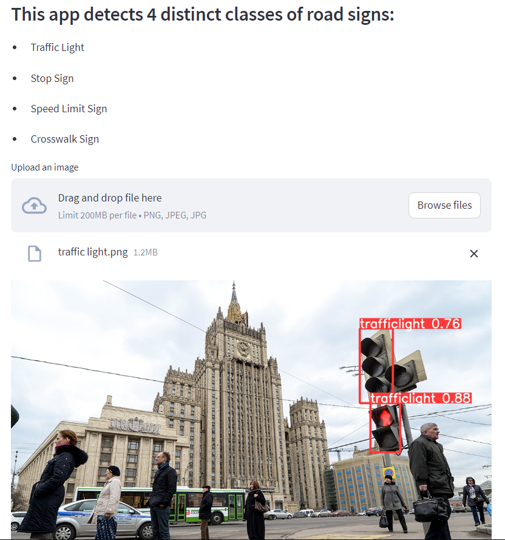

## Description

This web application allows users to upload an image containing road signs and use YOLOv5 model for object detection. The app classifies the image and displays the detected objects along with their respective labels.

#### The project is available
 [Traffic Sign Detection App](https://trafficsigns.streamlit.app/)


This Streamlit app detects 4 distinct classes of road signs:
- Traffic Light
- Stop Sign
- Speed Limit Sign
- Crosswalk Sign

## Usage

1. Upload an image using the "Upload an image" button.

2. Click the "Detect Sign" button to run the YOLOv5 model and detect the road signs in the uploaded image.

3. The original image along with the detected objects and their labels will be displayed below.


## Installation
1. Clone the repository:
```sh
git clone <repository_url>
```

2. Create virtual environment (it needs for library consistency). 
```sh
python -m venv venv
```
2. Activate virtual environment (Windows)
```sh
source venv/Scripts/activate 
```
4. To run this project, you need to download some libriaries

You can install the dependencies by running the following command:
```sh
pip install -r requirements.txt
```

## File Structure

The main components of the app are as follows:

- `traffic_signs.py`: The main Streamlit application file containing the UI and app logic.
- `yolov5/detect.py`: The script that uses YOLOv5 model for object detection.
- `yolov5/runs/train/exp/weights/best.pt`: Pretrained model weights for object detection.

The `uploaded_images` directory will be created at runtime to store the uploaded image.

## Running the App

To run the app, use the following command:
```sh
streamlit run app.py
```

The app will be accessible in your browser at `http://localhost:8501`.

## App view



### Enjoy using the Traffic sign Detection App!
